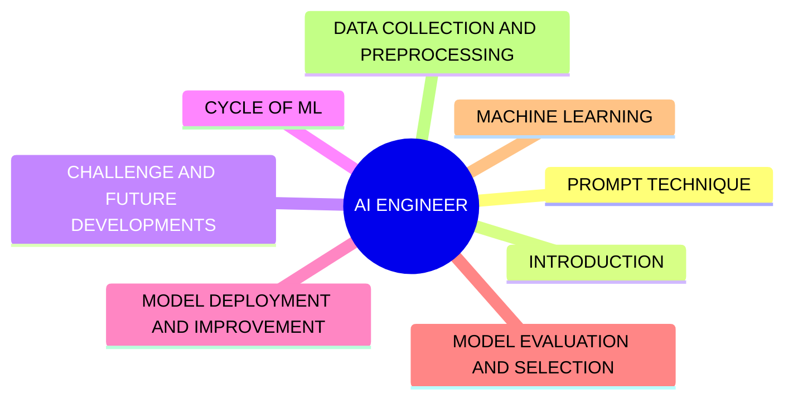

---
cssclasses:
  - cornell-left
  - cornell-border
tags:
  - ai-engineer
  - moc
  - overview
  - machine-learning
  - deep-learning
priority: P0
order: 0
topic-group: Overview
gist: Master Map of Content for AI Engineer Knowledge Domain
aliases:
  - AI Engineer MOC
  - AI Engineer Master Note
---
> [!summary] Summary
> - This Master Map of Content (MOC) provides a comprehensive overview of the AI Engineering knowledge domain.
> - It acts as an central index for various topics ranging from AI introduction and prompt engineering, to machine learning cycles, data preparation, evaluation, deployment, and future challenges.

## 📌 Original EdrawMind Mindmap & Note

> [!quote] Mindmap Source Content
> ```text
> AI ENGINEER
> 	PROMPT TECHNIQUE
> 	INTRODUCTION
> 	CHALLENGE AND FUTURE DEVELOPMENTS
> 	CYCLE OF ML
> 	MODEL DEPLOYMENT AND IMPROVEMENT
> 	MODEL EVALUATION AND SELECTION
> 	MACHINE LEARNING
> 	DATA COLLECTION AND PREPROCESSING
> ```

---

> [!cue] What is it?

### AI Engineering Knowledge Index



**01_Introduction**
- [[01_AI-Capabilities-and-Types]]: Overview of ANI, AGI, and Super AI.
- [[02_AI-Functionalities]]: Reactive, Limited Memory, Theory of Mind, and Self-Aware AI.

**02_Machine-Learning**
- [[01_ML-Fundamentals-and-Terminology]]: Core ML concepts, cost vs. loss, data quality, and model interpretability.
- [[02_Supervised-Semi-Unsupervised-RL]]: Paradigms of machine learning (Supervised, Semi-supervised, Unsupervised, Reinforcement Learning).
- [[03_Deep-Learning-Architectures]]: Neural network layers, mathematical notation, activation functions, and architecture types.

**03_ML-Lifecycle**
- [[01_Project-Scoping-and-Dataset]]: Project goal formulation, single evaluation metrics, and dataset splitting (train/dev/test/train-dev).
- [[02_Training-Methods-and-Transfer-Learning]]: Choosing architectures, transfer learning, fine-tuning, multi-task learning, and end-to-end deep learning.
- [[03_Diagnostics-and-Error-Analysis]]: Bias-variance tradeoff, L2 regularization, error analysis, and data augmentation.

**04_Model-Evaluation-and-Selection**
- [[01_Model-Evaluation-and-Selection]]: Systematic model selection workflows, cross-validation, and metric selection.

**05_Model-Deployment-and-Improvement**
- [[01_Model-Deployment-and-MLOps]]: Serving paradigms (REST APIs, Microservices, Batch), cloud platforms, real-time monitoring, and CI/CD pipelines.
- [[02_Model-Improvement-Techniques]]: Orthogonalization, competition/benchmark strategies, ensembling, and test-time multi-crop.

**06_Challenges-and-Future**
- [[01_Ethical-Considerations]]: Bias and fairness, explainable AI (LIME/SHAP), privacy-preserving ML (Federated Learning, Differential Privacy), and GDPR.
- [[02_Advancements-in-ML]]: AutoML/NAS, meta-learning, adversarial ML, quantum ML, continual learning, and causal inference.

**07_Data-Collection-and-Preprocessing**
- [[01_Data-Collection-and-Preprocessing]]: End-to-end data pipelines, EDA, cleaning, scaling, encoding, and feature selection.
- [[02_Feature-Extraction-and-Word-Embeddings]]: Text feature extraction — one-hot/TF-IDF, dense word embeddings, Word2Vec, GloVe, and embedding bias.
- [[03_Image-Feature-Extraction-and-Edge-Detection]]: Image feature extraction — edge detection (Sobel/Prewitt/Canny), color histograms, and dimensionality reduction.

**08_Prompt-Technique**
- [[01_Prompt-Technique]]: Prompt engineering taxonomy, zero-shot, few-shot, and chain-of-thought (CoT) prompting.

> [!cue] Why is it important?

A structured knowledge base is essential for an AI Engineer to navigate the rapidly evolving landscape of machine learning, deep learning, and AI operations. It ensures a systemic understanding connecting basic data concepts up to deployment, helping trace the origin of errors, and ensuring robust model development. By categorizing into a Map of Content (MOC), retrieving theoretical knowledge or practical engineering steps becomes instantaneous, fostering continuous learning and integration of new research.

> [!cue] How is it related to ...?

This AI Engineering MOC stands on the shoulders of fundamental science disciplines.
- Connects to biological inspiration detailed in [[02_Neuroscience-Inspired-Artificial-Intelligence]].
- Relates to low-level compute hardware and neurological models via [[02_Brain-Hardware-and-Neurons]] and [[03_Cortical-Connectivity]].
- Builds upon foundational data representation from [[01_Memory-and-Data-Representation]].
