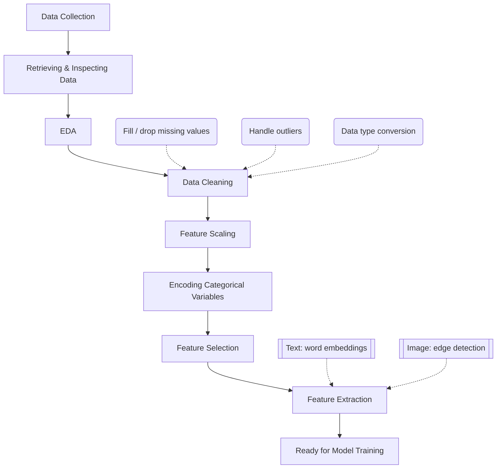

---
cssclasses:
  - cornell-left
  - cornell-border
tags:
  - data-collection
  - data-preprocessing
  - feature-engineering
  - data-cleaning
  - etl
  - eda
priority: P1
order: 1
topic-group: Data Engineering
gist: Foundational framework for data collection, EDA, and preprocessing pipelines in machine learning.
aliases:
  - Data Preprocessing Pipeline
  - Data Collection and Preparation
---
> [!summary] Summary
> - Data collection and preprocessing are foundational to any machine learning pipeline, often taking up to 80% of project time.
> - The process transforms raw data into a clean, structured format suitable for model training: collect → retrieve/inspect → explore (EDA) → clean → scale → encode → select/extract features.
> - It ensures data quality and handles issues like missing values, noise, and inconsistencies, which directly impact model performance.
> - Feature extraction (text and image) is large enough to have its own notes: see [[02_Feature-Extraction-and-Word-Embeddings]] and [[03_Image-Feature-Extraction-and-Edge-Detection]].

# 🗃️ Data Collection and Preprocessing

## 📌 Original EdrawMind Mindmap & Note

> [!quote] Mindmap Source Content (verbatim paste from EdrawMind)
> ```text
> DATA COLLECTION AND PREPROCESSING
> 	Data collection methods
> 		Scaping web data
> 			Label
> 		Surveys and questionares
> 		Publicly availabel datasets
> 	Retrieving data
> 		Reading data and showing it
> 	EDA
> 		We can use other function to check data:
> 		df.shape (watching all columns)
> 		df.describe(decribing all information about statistic)
> 		df.dtypes(to watch type of column)
> 		df.select_dtypes(exclude=["int64", "float64"] (choosing type of data we dont wanna see)
> 		Seeing other type of data such frequencies at record level (row), frequencies at paramenter/column level (column)
> 		We can use drawing figure to show
> 		Assess attribute for model -> watching correlation between feature
> 	Data preprocessing
> 		Data cleaning
> 			Check null value and fill data (fill missing values)
> 				Fill with mean, median, most frequence values
> 				Drop
> 				KNN is to find record having the same other values -> fill missing value
> 			Dealing with outliers
> 			Data type conversion
> 				Transfrom numerical variables
> 				Change all data from string or non-numerical into number (encode categorical variable)
> 		Feature scaling
> 			Normalization
> 			Standardization
> 			Robust scaliing
> 		Encoding Categorical Variables
> 			Label Encoding
> 			One-Hot Encoding
> 			Ordinal Encoding
> 			Target Encoding
> 			Frequency Enconding
> 		Feature selection
> 			Filter methods
> 				Correlation Coefficient
> 				Chi-squared test
> 			Wrapper method
> 				Recursive Feature Elimination (RFE)
> 			Embedded methods
> 				Lasso regression
> 				Tree-based feature importance
> 		Feature extraction
> 			Define
> 				This method that we will use pre-trained model to extract features from new dataset and then train a new classifier on these extracted features
> 				Use case
> 					When dataset is small and this dataset is not suitable for adjusting all parameters in pre-trained model
> 					Less computation cost than fine-tuning
> 			Text data
> 				(full text-data subtree — notation, word representation, word embeddings, Word2Vec, GloVe, bias — continued verbatim in [[02_Feature-Extraction-and-Word-Embeddings]])
> 			Image data
> 				(full image-data subtree — edge detection, color histograms, dimension reduction — continued verbatim in [[03_Image-Feature-Extraction-and-Edge-Detection]])
> 		Invent new features
> ```
> The text-data and image-data branches under **Feature extraction** are reproduced verbatim in full,
> unabridged, in their own notes rather than duplicated here twice — see the two child notes linked
> above and in "How is it related to ...?" below. Nothing from the original paste is summarized away;
> every line of it exists verbatim in exactly one of these three notes.

---

> [!cue] What is it?

Data collection and preprocessing refer to the end-to-end pipeline of gathering raw data and preparing it for machine learning models: **collect → retrieve & inspect → explore (EDA) → clean → scale → encode → select / extract features**.

### Data Preprocessing Pipeline



**Data collection methods**
- **Scraping web data** — with a *label* attached to what is scraped.
- **Surveys and questionnaires**.
- **Publicly available datasets**.

**Retrieving data**
- Reading the raw data in and showing it (e.g. `df.head()`), before any transformation.

**EDA (Exploratory Data Analysis)**
- `df.shape` — see all columns/rows at a glance.
- `df.describe()` — statistical summary of every column.
- `df.dtypes` — the type of each column.
- `df.select_dtypes(exclude=["int64", "float64"])` — filter out the column types you don't want to
  inspect right now.
- Frequencies at the **record level** (per row) vs. the **parameter/column level** (per column).
- Drawing figures (histograms, boxplots, heatmaps) to see distributions visually.
- Assessing which attributes matter for the model by watching **correlation between features**, e.g.:
  ```python
  import seaborn as sns
  plt.figure(figsize=(12, 6))
  # Default corr() uses Pearson for calculating linear correlation matrix
  sns.heatmap(numeric_df.corr(), cmap="BrBG", fmt=".2f", linewidths=2, annot=True)
  ```

**Data cleaning**
- **Missing values** — fill with mean/median/most-frequent value, drop the record, or use **KNN**
  imputation (find the record with the most similar *other* values and borrow its value for the
  missing field).
- **Outliers** — detect and handle (cap, transform, or remove) so they don't skew training.
- **Data type conversion** — transform numerical variables (e.g. scaling), and turn
  string/non-numerical data into numbers (this is exactly *encoding categorical variables*, below).

**Feature scaling**
- **Normalization** (min-max to a fixed range), **Standardization** (zero mean, unit variance),
  **Robust scaling** (uses median/IQR, resistant to outliers).

**Encoding categorical variables**
- **Label Encoding**, **One-Hot Encoding**, **Ordinal Encoding**, **Target Encoding**,
  **Frequency Encoding** — see [[02_Feature-Extraction-and-Word-Embeddings]] for why one-hot
  encoding in particular breaks down for large vocabularies (the same limitation that motivates word
  embeddings in NLP).

**Feature selection** — choosing which existing features to keep:
- **Filter methods** (score each feature independently of any model): Correlation Coefficient,
  Chi-squared test.
- **Wrapper methods** (search using a model's performance as the score): Recursive Feature
  Elimination (RFE).
- **Embedded methods** (selection happens as part of training): Lasso regression (L1 shrinks
  irrelevant coefficients to zero), tree-based feature importance.

**Feature extraction** — *creating* new, more useful features (often via a pre-trained model), rather
than picking among the existing ones. Useful when the target dataset is small and not suitable for
adjusting every parameter of a large pre-trained model, and it costs less compute than fine-tuning.
Split across two dedicated notes because of how much ground they cover:
- [[02_Feature-Extraction-and-Word-Embeddings]] — text data: one-hot/bag-of-words/TF-IDF, dense word
  embeddings, Word2Vec (skip-gram/CBOW), GloVe, bias in embeddings, tokenization.
- [[03_Image-Feature-Extraction-and-Edge-Detection]] — image data: edge detection (Sobel/Prewitt/
  Roberts/Scharr, LoG/DoG, Canny), color histograms, dimensionality reduction (KPCA).

**Invent new features** — manual feature engineering from domain knowledge, distinct from the
automatic *feature extraction* above.

> [!cue] Why is it important?

Data preprocessing is often cited as taking up 80% of a machine learning practitioner's time. The
quality of the input data dictates the upper bound of a model's capabilities. As emphasized by the
"Garbage In, Garbage Out" (GIGO) principle, even the most advanced models cannot learn effectively
from noisy, biased, or unstructured data. Proper preprocessing mitigates issues like label noise and
enables more effective weak supervision. EDA specifically is what tells you *which* preprocessing a
given dataset actually needs (missing values? outliers? skewed distributions? correlated/redundant
features?) instead of applying a generic pipeline blindly. Feature extraction matters on top of that
because raw representations (one-hot word vectors, raw pixel intensities) are frequently too sparse,
too high-dimensional, or too semantically empty for a model to learn from efficiently — dense,
learned representations (word embeddings, edges/gradients) carry far more signal per dimension.

> [!cue] How is it related to ...?

- [[01_ML-Fundamentals-and-Terminology]]: Preprocessing is deeply connected to ML fundamentals,
  particularly regarding data quality, GIGO, and handling label noise.
- [[01_Project-Scoping-and-Dataset]]: Defines what data needs to be collected and preprocessed in the
  context of the project dataset.
- [[01_Memory-and-Data-Representation]]: Relates to how the cleaned data is fundamentally represented
  in memory for efficient processing.
- [[02_Training-Methods-and-Transfer-Learning]]: Feature extraction (above) is transfer learning in
  its most literal form — reusing a pre-trained model's learned representations instead of training
  from scratch.
- [[02_Feature-Extraction-and-Word-Embeddings]] and [[03_Image-Feature-Extraction-and-Edge-Detection]]:
  the two child notes that carry the full "Feature extraction" branch of this mindmap verbatim.
