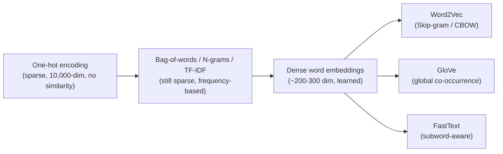

---
cssclasses:
  - cornell-left
  - cornell-border
tags:
  - feature-extraction
  - nlp
  - word-embeddings
  - word2vec
  - glove
  - transfer-learning
  - tokenization
priority: P1
order: 2
topic-group: Data Engineering
gist: Text feature extraction — from one-hot encoding to dense word embeddings, Word2Vec, GloVe, and embedding bias.
aliases:
  - Word Embeddings
  - Word2Vec and GloVe
  - Text Feature Extraction
---
> [!summary] Summary
> - Raw text can't be fed to a model directly; it first needs a numeric representation, and the choice of representation is a preprocessing decision, not a modeling detail.
> - One-hot / bag-of-words / TF-IDF representations are simple but sparse, high-dimensional, and carry no notion of semantic similarity between words.
> - Dense word embeddings (Word2Vec, GloVe, FastText) solve this by learning a low-dimensional vector per word from co-occurrence in large unlabeled text corpora, so semantically similar words end up with similar vectors — enabling analogy reasoning (king − man + woman ≈ queen) and effective transfer learning into small labeled tasks.
> - Because embeddings are learned from real text, they also learn real-world biases (e.g. gender-occupation stereotypes); debiasing (identify a bias direction, neutralize, equalize) is a known but incomplete mitigation.
> - Child note of [[01_Data-Collection-and-Preprocessing]] — this is the "Feature extraction → Text data" branch of that note's mindmap, reproduced verbatim below.

# 🔤 Feature Extraction and Word Embeddings

## 📌 Original EdrawMind Mindmap & Note

> [!quote] Mindmap Source Content — verbatim excerpt of "Feature extraction → Text data" from the mindmap in [[01_Data-Collection-and-Preprocessing]]
> ```text
> Text data
> 	Notation
> 		O_5000
> 			Meaning one-hot encoding of word apears value 1 in position 5000 of corpus (vocabulary)
> 		e_5000
> 			Word embedding matching position of one-hot encoding
> 		E
> 			The embedding matrix
> 				The way change one-hot encoding into word embedding vector
> 	Word representation
> 		Basic presentation
> 			Using one-hot encoding
> 				Define
> 					Traditionally, words in NLP are represented using one-hot encoding
> 					Each word in the vocabulary is assigned a unique index, and a vector is created where all elements are zero except for a one at the index corresponding to that word.
> 				Limitation
> 					Lack of semantic relationships
> 						One-hot vectors treat each word as independent and unrelated.
> 						The dot product between any two different one-hot vectors is zero, indicating no similarity.
> 					High dimensionality and sparsity
> 						With large vocabularies (e.g., 10,000 words), the vectors are high-dimensional and sparse.
> 						Computational inefficiency arises due to the high dimensionality.
> 					Poor generalization
> 				=> Word embedding (featurized representation) appears to solve these problems
> 			Bag-of-word
> 			Bag of N-grams
> 			TF-IDF vectorization
> 		Phase:
> Index-based representation -> init weight embedding matrix -> dense representation
> -> this will give these dense representation -> model -> model learning -> modify embedding matrix -> repeat to improve model
> 			This presentation needs to a step in index-based representation
> => This will indicate the position of word
> 				Build a vocabulary
> 				Use word-based tokenization
> 				Convert text into features
> 				Summary
> 				Padding all sentences => same length
> 					Append token "<pad>"
> 				Truncating
> 			Learning during training (weights)
> 			Dense presentation
> 				Word2Vec
> 				Glove
> 				Fasttext
> 				ELMO
> 				Watching in word embedding below:
> This presentation helps present the meaning of word with lower dimension compare basic presentation
> I.e. one-hot encoding needs to vector = 10,000 to indicating 10,000 words. And dense presentation about 200 - 300 dimension to indicate 10,000 words
> 	Word embeddings
> 		Define
> 			Dense vector representations
> 				Word embeddings are low-dimensional, dense vectors (e.g., 300 dimensions) where each dimension captures some latent feature of the word.
> 			Capturing semantic meaning
> 				These vectors are learned in such a way that words with similar meanings or roles have similar vector representations.
> 				While we might desire interpretable features (e.g., gender, royalty, age), embeddings learn latent features that may not be directly interpretable but capture complex patterns in data.
> 			Relating to neuroscience
> 				Neural Encoding:
> 					The brain represents information through patterns of activity across networks of neurons (distributed representations), similar to how embeddings represent words.
> 				Semantic Networks:
> 					Concepts in the brain are linked through semantic networks, where related concepts activate overlapping neural regions.
> 				Feature Encoding:
> 					Feature Detectors:
> 						Neurons may act as feature detectors, responding to specific attributes of stimuli (e.g., shape, color, motion), paralleling how embeddings encode features.
> 				Hebbian Learning:
> 					"Cells that fire together wire together":
> 					Hebbian learning principles suggest that simultaneous activation strengthens connections, akin to how co-occurrence in language corpora strengthens associations in embeddings.
> 				Analogies to Word Embeddings:
> 					Semantic Similarity:
> 						The brain's ability to generalize and understand analogies reflects how embeddings capture relationships between words.
> 					Cognitive Maps:
> 						Just as embeddings map words into a high-dimensional space, the brain maps sensory inputs into neural activity patterns. (same as use one-hot encoding with embedding matrix)
> 				Knowledge Transfer:
> 					The brain applies learned knowledge to new but related tasks.
> 					Example: Learning to play one instrument can facilitate learning another.
> 				Plasticity:
> 					The brain can fine-tune representations based on new experiences, similar to fine-tuning embeddings.
> 			This method is same as face encoding in face recognition
> 			Visualization with t-SNE
> (t-distributed Stochastic Neighbor Embedding)
> 				A dimensionality reduction technique that projects high-dimensional data into two or three dimensions for visualization.
> 				Shows how embeddings cluster semantically similar words together.
> 				Limitation
> 					t-SNE uses non-linear transformations, so geometric properties (like vector arithmetic) may not be preserved.
> 					Parallelogram relationships observed in high-dimensional space may not hold in t-SNE visualizations.
> 					=> This will make analogy reasoning being bad performance in this t-SNE
> 		How does it work?
> 			Through Neural Networks:
> 				Embeddings are often learned as part of training neural networks on language tasks (e.g., predicting a word based on its context).
> 			Trained on large unlabeled data
> 				Massive Text Datasets:
> 					Sources:
> 						Internet text, books, articles—potentially billions of words.
> 					Unlabeled Data:
> 						No manual annotations needed; the raw text is sufficient for learning embeddings.
> 				Advantages:
> 					Capturing Word Relationships:
> 						Co-occurrence patterns help embeddings learn semantic similarities.
> 						Words appearing in similar contexts tend to have similar embeddings (Distributional Hypothesis).
> 					Transfer Learning:
> 						Knowledge from large datasets can be transferred to specific tasks with smaller labeled datasets (e.g., NER).
> 			Analogy reasoning
> 				Define
> 					involves understanding the relationship between two pairs of concepts. 
> For example: "man is to woman as king is to queen."
> 					Word embeddings can capture these relationships, allowing algorithms to perform analogy reasoning automatically.
> 					Example below use computing vector differences to find result
> 				Process
> 					Compute the vector difference
> 						Calculate the difference between the embeddings of word "king" and word "man":
> 						difference = e_king - e_man
> 					Applying the difference to remaing word
> 						Add the difference to the embedding of word "woman":
> 						target_embedding = e_woman - difference
> 					Find the most similar word
> 						Find word "queen" (hidden word) by finding maximizes of cosine similarity
> 							A cosine similarity of 1 indicates that the vectors point in the same direction.
> 							A cosine similarity of 0 indicates orthogonality (no similarity).
> 							A cosine similarity of -1 indicates that the vectors point in opposite directions.
> 			Embedding matrix
> 				Define
> 					The embedding matrix contains the embedding vectors for all words in the vocabulary.
> 					Each column E_i in E is the embedding vector for the i-th word in the vocabulary
> 				In image
> 					The embedding matrix E is a 300-dimensional by 10,000-dimensional matrix (assuming 300-dimensional embeddings).
> 					Rows: Each of the 300 rows corresponds to a dimension in the embedding space.
> 					Columns: Each of the 10,000 columns corresponds to a word in the vocabulary.
> 				=> we wanna extract word embeddings by using matrix multiplication
> 				Pros
> 					Avoids Redundancy
> 						Instead of storing separate embedding vectors for each word, we consolidate them into a single matrix
> 					Computational Efficiency:
> 						Matrix operations are optimized in most programming frameworks, making it efficient to retrieve embeddings using matrix multiplication.
> 		Method
> 			Building a language model with neural network
> 				Handling input
> 					Preparation
> 						One-hot encoding of words
> 							Vocabulary Size: Assume 10,000 words.
> 							One-Hot Vectors: Each word is represented as a 10,000-dimensional vector with a 1 in the position corresponding to the word's index and 0s elsewhere.
> 						Embedding matrix E
> 							A matrix that maps one-hot vectors to dense embeddings
> 							If embeddings are 300 dimensional, E is a 300x10000 matrix
> 							Multiply one-hot encoding with embedding matrix (watching in EMBEDDING MATRIX ABOVE)
> 					Processing the input
> 						Embedding each word of input
> 							Convert all words in the input sequence (in one-hot encoding) to their embeddings using the embedding matrix
> 						Stacking embeddings
> 							Concatenate the embeddings to form a single input vector.
> 							Example: For six words with 300-dimensional embeddings, the input vector is 6 x 300 = 1800
> 				Neural network layers
> 					Hidden layer
> 						Processes the concatenated embeddings.
> 						Parameters include weights W_1 and biases b_1
> 					Softmax layer
> 						Outputs probabilities over the vocabulary for the next word.
> 						Parameters include weights W_2 and biases b_2
> 				Training the model
> 					Objective: Maximize the likelihood of predicting the correct next word.
> 					Loss Function: Typically cross-entropy loss between the predicted and true distributions.
> 					Optimization: Use backpropagation and gradient descent to update parameters E, W_1, b_1, W_2 and b_2
> 				***NOTE
> 					Improve performance of model by decreasing the number of input word
> 						Fixed historical window
> 							Instead of using all previous words, use a fixed number (e.g., last four words).
> 							Benefits:
> 								Simplifies the model and training process.
> 								Can handle sentences of varying lengths by considering only a subset of words.
> 						Surrounding words
> 							Words on both the left and right of the target word.
> 							Objective: Predict the word in the middle given its surrounding context.
> 							Application: Useful for models focusing on understanding word relationships rather than just sequence prediction.
> 						Single previous word
> 							Only the immediate previous word.
> 							Pros: Reduces the input size and complexity.
> 							Cons: May capture less context but can still learn meaningful embeddings.
> 						Nearby words (skip-gram model)
> 							Watching in word2Vec
> 			Word2Vec
> 				Define
> 					Uses models like Continuous Bag-of-Words (CBOW) and Skip-Gram to learn high-quality embeddings with efficiently computational with simpler method
> 					Skip-grams
> 						Objective
> 							Given a word (the context word c), the model predicts surrounding words (the target words t) within a certain window in a sentence.
> 							Purpose
> 								The primary goal is not to accurately predict the target words per se, but to adjust the word embeddings such that words appearing in similar contexts have similar vector representations.
> 								This aids in capturing semantic relationships between words.
> 						Process
> 							Instead of using fixed contexts (like the last four words), the skip-gram model randomly selects a word as the context and then randomly selects words within a specified window around it as target words.
> 							This forms context-target pairs for training.
> 						Advantages:
> 							Works well with smaller datasets.
> 							Captures precise semantics for each word.
> 						Disadvantages:
> 							Computationally intensive due to multiple target words per context word.
> 						=> suit with small dataset
> 					The newest paper v2 introduces continuous bag of words (CBOW)
> 						Objective
> 							It reverses the idea of skip-gram during training
> 							Skip-gram we will choose a content word (center word) -> predict  target word (surrounding word of center word)
> 
> With CBOW, we will choose surrounding context words -> predict center word
> 						Process
> 							Averages (or sums) the embeddings of context words to predict the target word.
> 						Advantages:
> 							Faster to train since it predicts one word from multiple inputs.
> 							Smooths over the distribution of the context, which can help in some cases.
> 						Disadvantages:
> 							May not capture the meaning of infrequent words as effectively.
> 						=> suit with large dataset
> 					Relating to neuroscience
> 						DIstributed representations
> 							The brain represents words and concepts through distributed patterns of neural activity.
> 							Similar concepts activate overlapping neural networks.
> 						Contextual learning
> 							Humans learn word meanings from the context in which words are used.
> 							The skip-gram model mimics this by learning word representations based on surrounding words.
> 						Hebbian learning principle
> 							"Neurons that fire together wire together":
> 							Frequently co-occurring words strengthen their associative representations in the brain.
> 							In skip-gram, words that appear together adjust their embeddings to be closer.
> 						Efficiency in neural processing
> 							The brain optimizes for efficiency by prioritizing important information.
> 							Hierarchical structures in the brain process common inputs more rapidly, similar to the hierarchical softmax optimizing for frequent words.
> 						Selective focus
> 							The brain allocates resources to process relevant stimuli more thoroughly.
> 							Subsampling of frequent words in skip-gram models reduces focus on common words, allowing the model to learn more about rarer, informative words.
> 				Building model
> 					Input
> 						With vocab size V = 10,000
> 					Output
> 						Embedding matrix
> 					Process
> 						Input representation
> 							Representing these vocab into vector with one-hot encoding O_c
> 							The index corresponding to the word c is 1 and all other indices are 0
> 						Embedding matrix E
> 							Dimensions
> 								Initial embedding matrix E is N x V shape
> 									is typically initialized with small random values.
> 									It is updated during training to capture meaningful word representations.
> 								V = 10,000 above and N we will choose dimension
> 							Obtaining embeddings
> 								The embedding of the context word c is obtained by: e_c = E x O_c
> 								This operation selects the c-th column of E
> 							Prediction layer
> 								Softmax function
> 									The model uses a softmax layer to predict the probability distribution over all possible target words.
> 									Parameter theta_t
> 										For each target word t, there is an associated parameter vector theta_t (with dimension N)
> 								Loss function
> 									Using negative Log-likehood
> 							Backpropagation
> 				Limitation
> 					Problem with context and target words during tranining
> 						Sampling context words c
> 							Uniform sampling
> 								Selecting context words uniformly at random from the text corpus.
> 							Issue with Frequent Words
> 								High-frequency words like "the," "of," "and," etc., dominate the sampling process.
> 								Leads to over-representation of these words in context-target pairs.
> 							Solution
> 								Using probability of keeping a word
> 								Effect
> 									Frequent words are discarded with higher probability
> 									Rare wirds are kept with higher probability
> 									Balances the datasets to give more empasis to less frequent words
> 						Sampling target word t
> 							Fixed window size
> 								Define a window size k indicating how many words before and after the context word to consider
> 							Dynamic window size
> 								Some implementations vary the window size dynamically during training for added randomness
> 					Expensive computation
> 						The denominator in the softmax function sums over the entire vocabulary V, making each update computationally expensive, specially with large vocabularies
> 						For vocabularies of size V = 100,000 or more, this becomes a significant bottleneck
> 						Solution
> 							Hierarchical softmax
> 								Concept
> 									Replaces the flat softmax layer with a binary tree structure of classifiers.
> 									Each internal node is a binary classifier that decides between two subsets of words.
> 								Structure
> 									The tree leads from the root to leaves, where each leaf represents a word in the vocabulary.
> 									The path from the root to a leaf corresponds to a sequence of binary decisions to identify a word.
> 									Huffman Coding:
> 										The tree doesn't have to be perfectly balanced.
> 										Frequently occurring words are placed closer to the root, resulting in shorter paths for common words.
> 										This further improves efficiency since common words are processed more often.
> 								Pros
> 									Reduces the computational complexity from O(V) to O(log V)
> 							Negative sampling
> 								Concept
> 									Simplifies the training objective by only updating a small number of output nodes per training example.
> 									Instead of computing probabilities for all words, it only considers a few negative samples. (reformulate the objective to avoid computing over the entire vocab)
> 									=> reconstruct the training set
> 										Labelling
> 											Assign a label of 1 to positive examples (context and target words that co-occur).
> 											Assign a label of 0 to negative examples (context word paired with random words).
> 										Training objective
> 											The goal is to train a binary classifier to distinguish between positive and negative pairs.
> 											The model learns to predict the probability that a given context-target pair is a genuine co-occurrence in the corpus.
> 								Process
> 									Input representation
> 										Context word embedding (e_c)
> 											Represent the context word c using its embedding vector obtained from the embedding matrix E
> 											e_c = E x O_c
> 												O_c is one-hot vector  for c
> 										Target word embedding (theta_t)
> 											Each target word t (including negative samples) has an associated vector theta_t
> 											This can be thought of as a separate embedding matrix for target words
> 									Binary classification with logistic regression
> 										Using sigmoid
> 										Loss function with binary-cross entropy
> 											Each positive pair
> 												Compute the loss for the positive example
> 												Generate k negative examples and compute the loss for each
> 									Backpropagation
> 										Use optimization algorithms like Stochastic Gradient Descent (SGD) or adam to update the embedding e_c and theta_t to minimize the total loss over all examples
> 									****NOTE
> 										It has the same problem with traditional way that selects negative samples affecting the quality of the learned embeddings. 
> 
> Randomly selecting words uniformly from vocab is not ideal because there are some words appearing more frequently as "the", "and", etc 
> 										Uniform negative example is 1/|v|
> 										=> Solving it by
> 											Use a smoothed distribution where each word's sampling probability is proportional to its frequency raised to the 3/4 power:
> 											Why use 3/4?
> 												Balancing Act:
> 													Reduces the probability of very frequent words compared to their true frequencies.
> 													Prevents the model from being dominated by frequent words while still sampling them more often than rare words.
> 												Empirical Success:
> 													Although not theoretically derived, this heuristic has been found to work well in practice.
> 								Pros
> 									Significantly reduces computation.
> 										Instead of updating parameters for all words in the vocabulary, the model only updates parameters for the context word, the positive target word, and k negative target words
> 										Significantly reduces computational load, especially for large vocabularies.
> 									Allows for training on much larger datasets.
> 			GloVe
> 				Define
> 					Combines global word-word co-occurrence statistics from a corpus to learn embeddings.
> 					Objective
> 						aims to incorporate global word co-occurrence statistics to learn more comprehensive word embeddings because Word2Vec and similar models primarily leverage local context, potentially missing global statistical information.
> 						Create word vectors such that their dot product predicts the logarithm of the probability that two words co-occur. 
> 
> Combines the advantages of count-based methods (like Latent Semantic Analysis) and predictive methods (like Word2Vec). 
> 					Method
> 						Uses a weighted least squares regression model that directly factors the log of the co-occurance matrix
> 						Embeddings capture the ratios of co-occurrence probabilities, encoding meaningful vector differences
> 				Building
> 					Forward
> 						Construct X
> 							Traverse the corpus and count how often each word j appears in the context of word i
> 							-> we will have a co-occurrence matrix X where each entry X_ij represents the count
> 							***NOTE
> 								If the context window is symmetric, the co-occurence matrix X will also be symmetric (X_ij = X_ji)
> 								However, if the context is asymmetric (i.e only preceding words) -> X_ij != X_ji
> 						Glove model objective function
> 							Loss function
> 								w = theta
> 								w~ = e
> 								Explanation
> 									The goal is to minimize the squared difference between the dot product of word vectors (plus biases) and the logarithm of the co-occurrence count.
> 									This encourages word pairs with high co-occurrence to have vectors that produce a higher dot product.
> 							Weighting function f(X_ij)
> 								Purpose
> 									Appropriate weights to different word pairs to prevent frequent words from dominating the training (the, a, and, etc)
> 									Ensures that rare co-occurrences are not given undue improtance (coi trọng quá mức)
> 								Formulation
> 					Backward
> 						Parameter to learn
> 							Word vectos w_i (for each word i)
> 							Context word vectors w~_j (for each word j)
> 							Bias terms b_i and b~_i
> 						Optimization
> 							Minimize loss function J by adam or SGD
> 							Onl;y sum over word pairs where X_ij > 0 to avoid undefined logarithms
> 						Final word vectors
> 							After trainig, the final embedding for a word i can be obtained by combining its word vector and context vector and average to capture the complete representation
> 							v_i  = (w_i + w~_i) / 2
> 								The roles of w and w~ are symnmetric
> 				Note for featurization view of word embeddings
> 					Non-interpretable individual dimensions
> 						Lack of alignment
> 							Individual dimensions of the embeddings do not correspond to specific semantic features (e.g., gender, royalty).
> 							Due to rotational invariance, the axes can be transformed without changing the relational properties.
> 						Linear relationships
> 							Despite the lack of interpretability of individual dimensions, linear combinations capture meaningful relationships.
> 							The parallelogram property for analogies still holds.
> 					Rotational invariance
> 						Mathematical explanation
> 							If A is an invertible matrix, then the transformed embeddings Aw_i (A x theta_i) preserve dot products up to a linear transformation
> 							The objective function remains minimized under such transformations
> 						Implication
> 							The geometric relationships between word vectors are preserved, even if the axes are rotated or scaled.
> 				Pros and cons
> 					Pros
> 						Performance
> 							GloVe achieves performance on par with or better than Word2Vec on various tasks.
> 							Effective at capturing both syntactic and semantic word relationships.
> 						Interpretability
> 							The reliance on co-occurrence statistics provides an interpretable foundation for the embeddings.
> 						Efficiency
> 							By leveraging matrix factorization techniques and sparse matrices, GloVe can train faster on large corpora.
> 						Flexibility
> 							The model can be adjusted by changing the window size or weighting function to suit specific datasets or tasks.
> 					Cons
> 						Memory Usage:
> 							Storing the full co-occurrence matrix can be prohibitive for very large corpora and vocabularies.
> 						2. Rare Words:
> 							Words with very low frequencies may not have reliable co-occurrence statistics, affecting the quality of their embeddings.
> 						3. Contextual Meaning:
> 							Like Word2Vec, GloVe produces static embeddings.
> 							It doesn't account for polysemy (words with multiple meanings depending on context).
> 			Comparation between word2vec and glove
> 				Approach
> 					Word2Vec:
> 						Predicts surrounding words given a target word (Skip-Gram) or predicts the target word given surrounding words (CBOW).
> 						Focuses on local context windows.
> 					GloVe:
> 						Uses global co-occurrence counts to capture word relationships.
> 						Constructs a word-word co-occurrence matrix for the entire corpus.
> 				Traning objective
> 					Word2Vec:
> 						Optimizes a probabilistic model using techniques like negative sampling.
> 					GloVe:
> 						Optimizes a least squares regression model aligning vector dot products with log co-occurrence counts.
> 				Computational efficiency
> 					Word2Vec:
> 						Efficient for large datasets but may require significant computation for very large vocabularies.
> 					GloVe:
> 						Can be more efficient when leveraging sparse matrix operations and precomputed co-occurrence statistics.
> 			FastText
> 				Extends Word2Vec by considering subword information, which helps with rare words.
> 		Applying in real world
> 			After having model for word embedding -> we will use transfer learning to apply this word embedding model for specific tasks
> 				Learning word embeddings from large text corpus
> 					Use methods like Word2Vec, GloVe, or FastText.
> 					Alternatively, download pre-trained embeddings (e.g., GloVe vectors).
> 				Apply embeddings to a specific NLP task
> 					Replace one-hot vectors with embeddings as input features.
> 					Use embeddings to represent words in the task's dataset.
> 				When we use transfer learning?
> 					The source task has a large dataset (e.g., learning embeddings from large corpora).
> 					The target task has a smaller dataset (e.g., NER with limited annotations).
> 			Fine-tuning embeddings
> 				When to Fine-Tune:
> 					If the task-specific labeled dataset is sufficiently large.
> 					Fine-tuning adjusts embeddings to better suit the specific task.
> 				When Not to Fine-Tune:
> 					If the labeled dataset is small, fine-tuning may lead to overfitting.
> 					Keeping embeddings fixed preserves the knowledge learned from the large corpus.
> 		Pros
> 			Semantic Similarity:
> 				Words like "apple" and "orange" end up with similar vectors because they share features (e.g., they are both fruits).
> 			Analogical Reasoning:
> 				Embeddings can capture relationships such that vector arithmetic can reveal analogies:
> 				Example: King - Man and Woman - Queen
> 			Improved Generalization:
> 				Models can generalize from known contexts to new but similar contexts.
> 			Improving NLP Applications:
> 				Enhanced Performance:
> 					Embeddings improve the performance of NLP tasks such as machine translation, sentiment analysis, and question answering.
> 				Data Efficiency:
> 					Models can learn effectively even with smaller datasets because embeddings transfer knowledge about word relationships.
> 				Contextual Representations:
> 					Word embeddings allow models to handle words with multiple meanings by considering context (further advanced by models like ELMo and BERT).
> 		Problem of bias in word embedding 
> 			Define
> 				Bias algorithms can perpetuate and amplify existing societal bias, which leads to unfair or discriminatory outcomes (kết quả phân biệt đối xử)
> 				Type of bias
> 					Gender
> 						Stereotypical associations between genders and professions or roles.
> 					Ethnicity
> 						Unfair associations based on race or ethnicity.
> 					Age, sexual orientation, socioeconomic status
> 						Other dimensions along which biases can occur.
> 				Issue
> 					Word embeddings can inadvertently encode biases present in the training data.
> 					I.e. Associating "man" with "computer programmer" and "woman" with "homemaker" reflects gender stereotypes.
> 
> => Biased embeddings can lead to unfair or discriminatory behavior in AI applications, such as language translation, sentiment analysis, or search algorithms. 
> 				Source of bias
> 					Embeddings are trained on large corpora of text that may contain biased language and representations.
> 					The models capture statistical patterns, including biases, from the data.
> 				Impact
> 					Embeddings used in downstream tasks can propagate and even amplify these biases.
> 					Important decisions influenced by AI systems may become biased, affecting fairness and equality.
> 			Method to solve
> 				Identifying the bias direction
> 					Objective
> 						Find a direction in the embedding space that captures the bias (e.g., gender bias in picture show differences from left to right).
> 					Method
> 						Collect gender pairs
> 							Pairs of words that are gender-specific and counterparts (e.g., "he" and "she," "man" and "woman," "king" and "queen", "doctor" and "babysit").
> 						Compute differences
> 							For each pair, compute the difference vector: 
> 
> d_i = e_male-i - e_female-i 
> 						Average or apply PCA
> 							Aggregate the difference vectors to find the primary direction representing gender bias.
> 							Principal Component Analysis (PCA) can be used to find the dominant components.
> 					Explain
> 						A bias direction b (bias axis in pincture) in the embedding space that captures the bias.
> 				Neutralization step
> 					Objective
> 						Remove the bias component from embeddings of words that should be gender-neutral (e.g., "doctor," "nurse," "babysitter").
> 					Method
> 						For each non-definitional word w
> 							Project the embedding e_w onto the bias direction b
> 							Subtract this component to get the debiased embedding
> 					Explain
> 						This operation removes the component of the embedding that lies along the bias direction, making the word embedding gender-neutral.
> 				Equalization step
> 					Objective
> 						Ensure that word pairs that are meant to be gender-specific (e.g., "grandmother" and "grandfather") are equidistant from gender-neutral words.
> 					Method
> 						For each gender pair (w, w')
> 							Compute the mean embedding
> 							Remove the bias component from mean
> 							Adjust the embedding
> 					Explain
> 						Aligns the embeddings such that they are equidistant from the neutral words along the bias direction while preserving their unique characteristics.
> 			Limitation
> 				Incomplete Removal of Bias:
> 					Debiasing methods may not eliminate all forms of bias.
> 					Subtle or indirect biases might persist.
> 				Contextual Embeddings:
> 					Newer models like BERT generate context-dependent embeddings, making debiasing more complex.
> 					Requires adaptation of techniques to handle dynamic embeddings.
> 				Ethical Implications:
> 					Debiasing must be done thoughtfully to avoid unintended consequences.
> 					Collaboration with ethicists and domain experts is recommended.
> 	Tokenization
> 		Sentence tokenization
> 		Word-based tokenization
> 		Character-based tokenization
> ```

---

> [!cue] What is it?

Text feature extraction is the process of turning words into numbers a model can consume, moving
from **sparse, symbolic** representations to **dense, learned** ones:



**Notation used throughout this note:** `O_5000` is the one-hot vector with a 1 at index 5000 of the
vocabulary; `e_5000` is that word's embedding vector; `E` is the embedding matrix that maps one-hot
vectors to embeddings (`e_c = E × O_c`, which just selects column *c* of `E`).

**One-hot encoding** assigns each vocabulary word a unique index and a vector of all zeros except a
1 at that index. It is simple but: (1) has no notion of similarity — the dot product between any two
distinct one-hot vectors is always zero; (2) is extremely high-dimensional and sparse for real
vocabularies (10,000+ words); (3) generalizes poorly. Bag-of-words, bag of N-grams, and TF-IDF build
on top of one-hot counts but inherit the same sparsity problem.

**Dense word embeddings** (Word2Vec, GloVe, FastText, ELMo) fix this: instead of one dimension per
vocabulary word, every word gets a short (~200-300 dimensional) dense vector, learned so that words
with similar meaning or role end up with similar vectors. Individual dimensions are usually not
individually interpretable (no single "gender" or "royalty" axis exists in general), but **linear
combinations** of dimensions capture real relationships — which is exactly what makes analogy
reasoning work: `e_king − e_man ≈ e_queen − e_woman`, so `e_woman + (e_king − e_man)` lands close to
`e_queen` in cosine similarity. This can be visualized in 2-3 dimensions with **t-SNE**, though t-SNE's
non-linear projection does not preserve vector arithmetic, so analogy geometry looks worse there than
it actually is in the full embedding space.

**How embeddings are learned:** as a side effect of training a neural network on a language task over
massive unlabeled text (no manual annotation needed) — the network needs a good embedding matrix `E`
to do that task well, and gradient descent finds one. Two dominant families:

- **Word2Vec** — Skip-gram (given the center/context word, predict surrounding words; suits small
  datasets, captures precise per-word semantics) and CBOW (given surrounding context words, predict
  the center word; faster, suits large datasets, weaker on rare words). Trained with a softmax over
  the whole vocabulary, which is expensive at scale (`O(V)` per update), so two standard speedups
  exist: **hierarchical softmax** (a Huffman binary tree of classifiers, `O(log V)`, frequent words
  get shorter paths) and **negative sampling** (turn the problem into binary classification: is this
  context-target pair real or fake, scored against `k` sampled negatives per positive; negatives are
  sampled from a frequency^(3/4) distribution rather than uniformly, so very common words like "the"
  don't dominate). Also: very frequent context words are subsampled/discarded with higher probability
  during training so rarer, more informative words get more attention.
- **GloVe** — instead of a sliding local window, first builds a global word-word co-occurrence matrix
  `X` over the whole corpus, then fits word vectors so their dot product (plus biases) predicts
  `log(X_ij)`, weighted by a function that down-weights very frequent pairs. Final embedding for a
  word averages its "word" and "context" vectors: `v_i = (w_i + w̃_i) / 2`.
- **FastText** extends Word2Vec with subword (character n-gram) information, which helps with rare
  and out-of-vocabulary words.

**Applying it / transfer learning:** learn embeddings once on a large unlabeled corpus (or download
pre-trained ones), then plug them in as the input representation for a smaller labeled task (e.g.
NER). Fine-tune the embeddings further only when the target labeled dataset is large enough to avoid
overfitting; otherwise keep them fixed.

**Tokenization** (splitting text into units before any of the above): sentence-level, word-based, or
character-based.

**Bias in word embeddings:** because embeddings are learned from real text, they also learn the
biases present in that text (e.g. "man"↔"computer programmer", "woman"↔"homemaker"). Mitigation:
(1) identify a **bias direction** from a set of gender-defining word pairs (he/she, king/queen, ...)
via averaged difference vectors or PCA; (2) **neutralize** — project non-definitional words (doctor,
nurse) onto that direction and subtract the component out; (3) **equalize** — make gender-pair words
(grandmother/grandfather) equidistant from the neutral words. This is a known, useful, but
**incomplete** mitigation — subtler biases persist, and contextual models (BERT) make it harder still.

> [!cue] Why is it important?

The representation choice is not cosmetic — it determines what a downstream model *can* learn at
all. Sparse one-hot/TF-IDF features carry zero notion of "these two words mean similar things," so a
model trained on them can't generalize from "the cat sat" to "the feline sat" without seeing that
exact word in training. Dense embeddings inject that similarity structure for free, learned once on
huge unlabeled corpora and reused (transfer learning) across many smaller downstream tasks — which is
exactly why this sits under **Feature extraction** in [[01_Data-Collection-and-Preprocessing]]: it is
literally "use a pre-trained model's representations instead of learning from scratch," at far lower
compute cost than fine-tuning. The bias discussion matters for the same reason preprocessing choices
matter generally (see "Why is it important?" in [[01_Data-Collection-and-Preprocessing]]) — GIGO
applies to representations too: an embedding trained on biased text produces biased downstream
behavior no amount of careful modeling later can fully undo.

> [!cue] How is it related to ...?

- [[01_Data-Collection-and-Preprocessing]]: parent note — this is its "Feature extraction → Text
  data" branch, split out because of size; also see that note's "Encoding categorical variables"
  section, which one-hot encoding here is a special (text) case of.
- [[02_Training-Methods-and-Transfer-Learning]]: word embeddings are the canonical example of
  transfer learning discussed there — learn once on a large source task, reuse on a small target
  task.
- [[03_Deep-Learning-Architectures]]: embeddings are typically learned by, and consumed by, the
  neural network architectures covered there (the embedding layer feeds hidden/softmax layers exactly
  as described in "Building a language model with neural network" above).
- [[02_Neuroscience-Inspired-Artificial-Intelligence]]: the mindmap's own "Relating to neuroscience"
  asides above (distributed representations, Hebbian learning, semantic networks, knowledge transfer)
  connect directly to this note.
- [[01_Ethical-Considerations]]: the bias/debiasing section above is a concrete instance of the
  fairness and bias concerns discussed there.
