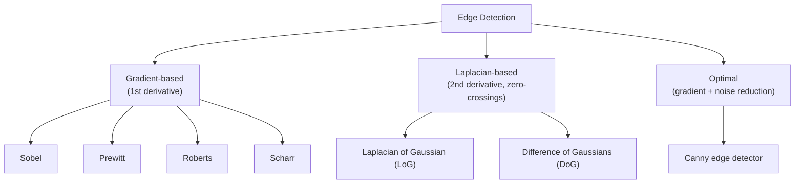

---
cssclasses:
  - cornell-left
  - cornell-border
tags:
  - feature-extraction
  - computer-vision
  - edge-detection
  - dimensionality-reduction
priority: P1
order: 3
topic-group: Data Engineering
gist: Image feature extraction — edge detection (Sobel/Prewitt/Canny), color histograms, and dimensionality reduction (KPCA).
aliases:
  - Edge Detection
  - Image Feature Extraction
---
> [!summary] Summary
> - Image feature extraction turns raw pixel grids into representations a model can use more easily, the visual-data counterpart of [[02_Feature-Extraction-and-Word-Embeddings]] for text.
> - Edge detection finds sharp intensity discontinuities via convolution — gradient-based (Sobel, Prewitt, Roberts, Scharr), Laplacian-based (LoG, DoG), or optimal (Canny, which adds noise reduction) — and underlies object recognition, segmentation, and motion detection.
> - Dimensionality reduction (e.g. KPCA) is the unsupervised-learning counterpart: compress many correlated pixel/feature dimensions into fewer, more informative ones.
> - Child note of [[01_Data-Collection-and-Preprocessing]] — this is the "Feature extraction → Image data" and "Feature extraction → Dimension reduction" branches of that note's mindmap, reproduced verbatim below.

# 🖼️ Image Feature Extraction and Edge Detection

## 📌 Original EdrawMind Mindmap & Note

> [!quote] Mindmap Source Content — verbatim excerpt of "Feature extraction → Image data" and "Feature extraction → Dimension reduction" from the mindmap in [[01_Data-Collection-and-Preprocessing]]
> ```text
> Image data
> 	Edge detection
> 		Define
> 			Edge detection is a fundamental technique in computer vision and image processing that involves identifying and locating sharp discontinuities in an image.
> 			This method bases on convolution operation in math
> 			Its application
> 				Object Recognition: Edges define the boundaries of objects, which is essential for recognizing and classifying them.
> 				Image Segmentation: By identifying edges, an image can be partitioned into regions for further analysis.
> 				Feature Extraction: Edges provide salient features that are robust to lighting conditions and color variations.
> 				Motion Detection: In video sequences, edges help in detecting and tracking moving objects.
> 		Method
> 			Gradient-Based Methods
> 				Define
> 					Compute the first derivative of the image intensity.
> 				Some types of operation
> 					Sobel
> 					Prewitt
> 					Roberts
> 					Scharr
> 			Laplacian-Based Methods
> 				Define
> 					Compute the second derivative of the image intensity.
> 					Detect zero-crossings in the second derivative.
> 				Some types of operation
> 					Laplacian of Gaussian (LoG)
> 					Difference of Gaussians (DoG)
> 			Optimal Edge Detection
> 				Define
> 					Combines gradient methods with noise reduction.
> 				Some types of operation
> 					Canny edge detector
> 		Example of edge detetection
> 			Vertical edge detection
> 				We apply filter suiting with original matrix
> Then we will slide 1 value and  then calculate convolution operation 
> Then we also move down 1 value 
> 				Concrete example for simple visualization
> We can be easy to see that the vertical edge between two color in original matrix, which can zoom 
> 				If we flip our matrix -> our result will negative
> 			Horizontal edge detection
> 				We will change our filter
> 			These two ways is following that from left to right and top to bottom is light to dark
> These example is Prewitt filter
> 	Color histograms
> Dimension reduction
> 	KPCA for multi-dimension
> 	Dimensionality reduction technique (in unsupervised learning)
> ```

---

> [!cue] What is it?

Edge detection locates sharp intensity discontinuities in an image using **convolution**, so it can
serve as a compact, lighting/color-robust feature for downstream tasks (object recognition, image
segmentation, motion detection in video). Three families:



- **Gradient-based** (Sobel, Prewitt, Roberts, Scharr) — compute the first derivative of image
  intensity; a strong gradient magnitude marks an edge.
- **Laplacian-based** (LoG, DoG) — compute the second derivative and detect its zero-crossings.
- **Optimal** (Canny) — combines a gradient method with explicit noise reduction for cleaner results.

**Worked example (Prewitt-style filter):** slide a small filter across the image matrix, computing a
convolution at each position (shift one column, then one row, and repeat). For **vertical** edge
detection the filter responds to left-to-right intensity change; flipping the filter flips the sign
of the result. For **horizontal** edge detection, the filter is changed to respond to top-to-bottom
intensity change instead. In both cases the convention is that the filter responds to a transition
from light to dark, moving left-to-right / top-to-bottom respectively.

**Color histograms** — a complementary, much simpler feature: the distribution of pixel color/
intensity values in an image, independent of spatial layout.

**Dimension reduction** (the sibling branch to feature extraction in general): compressing many
correlated dimensions into fewer, more informative ones. **KPCA** (Kernel PCA) extends ordinary PCA
with a kernel trick to capture non-linear structure across many dimensions; more generally,
dimensionality reduction is an **unsupervised learning** technique, not tied to images specifically
(it applies just as well to tabular or text-embedding features).

> [!cue] Why is it important?

Raw pixel intensities are extremely high-dimensional and sensitive to lighting/color variation that
has nothing to do with the underlying object, which is exactly the sparsity/robustness problem
[[02_Feature-Extraction-and-Word-Embeddings]] describes for one-hot text vectors. Edge maps are a
hand-crafted feature extractor that solves this for vision the same way pre-trained embeddings solve
it for text: a compact, more invariant representation that a simpler downstream model can work with
directly, at far lower cost than learning everything end-to-end from raw pixels. This is also the
direct mathematical predecessor to convolutional filters in CNNs — a CNN's early layers learn
edge-like filters automatically instead of using a fixed Sobel/Canny kernel. Dimensionality reduction
matters for the same underlying reason as feature selection in [[01_Data-Collection-and-Preprocessing]]:
fewer, less-redundant dimensions mean less overfitting risk and cheaper training.

> [!cue] How is it related to ...?

- [[01_Data-Collection-and-Preprocessing]]: parent note — this is its "Feature extraction → Image
  data" and "Feature extraction → Dimension reduction" branches, split out because of size.
- [[02_Feature-Extraction-and-Word-Embeddings]]: the text-data sibling of this note under the same
  "Feature extraction" branch; both exist to turn a sparse/raw representation into a compact,
  informative one.
- [[03_Deep-Learning-Architectures]]: the convolution operation behind every edge-detection filter
  here is the same operation a CNN's convolutional layers learn automatically; edge detectors are a
  hand-designed special case of what a CNN's early filters converge to.
