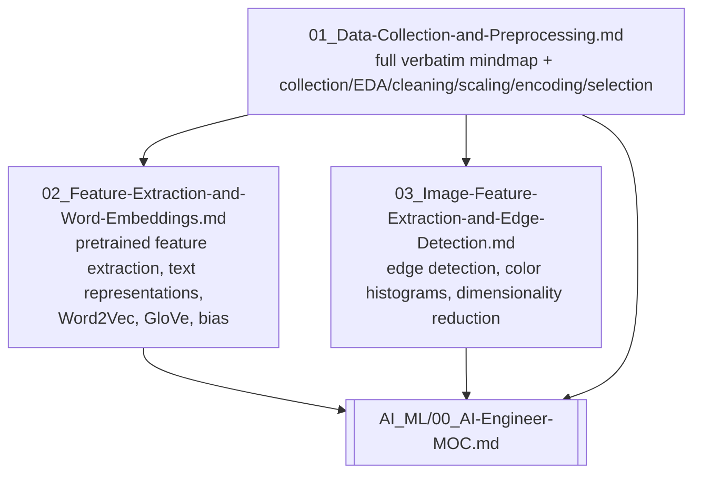

# Research: Organizing the pasted EdrawMind mindmap into Cornell notes

## Applicability

This task is reorganizing the user's own existing content (a pasted EdrawMind outline) into their
own existing Obsidian vault, following a template and conventions already present in-tree. No
outside/library research is required to do the work; the facts needed are in the repository itself:

- The exact template contract: `10_System/Templates/Cornell-Note (Templater).md`.
- The established pattern for how a mindmap becomes a Cornell note, taken from two already-written
  examples in the same vault: `AI_ML/07_Data-Collection-and-Preprocessing/01_Data-Collection-and-Preprocessing.md`
  (same topic, currently a placeholder) and `AI_ML/02_Machine-Learning/03_Deep-Learning-Architectures.md`
  (a fully-worked example of the same pattern at similar content depth).
- The set of existing notes available for the "How is it related to ...?" cross-links, confirmed to
  exist by `find`/`grep` rather than assumed: `AI_ML/02_Machine-Learning/01_ML-Fundamentals-and-Terminology.md`,
  `AI_ML/03_ML-Lifecycle/01_Project-Scoping-and-Dataset.md`,
  `AI_ML/03_ML-Lifecycle/02_Training-Methods-and-Transfer-Learning.md` (transfer learning ties
  directly to the mindmap's "feature extraction... use a pre-trained model" content),
  `AI_ML/02_Machine-Learning/03_Deep-Learning-Architectures.md` (CNNs relate to the mindmap's edge
  detection / image feature extraction content), `Computer_Science/01_Core-Concepts/01_Memory-and-Data-Representation.md`,
  and `Neuroscience/02_Neuroscience-Inspired-Artificial-Intelligence.md` (the mindmap's own
  "Relating to neuroscience" asides on Hebbian learning and distributed representations point here
  directly).

No web research, external citation, or literature review is applicable: the content is the user's
personal study notes on already-established, textbook ML/NLP concepts (one-hot encoding, Word2Vec,
GloVe, edge detection), not a claim needing outside verification.

## Refine

Refinement of the objective, from reading the existing `01_Data-Collection-and-Preprocessing.md`
note and the vault's atomic-note convention (every existing `AI_ML/**/*.md` file is 60-190 lines,
one coherent subtopic each):

- The pasted mindmap is one EdrawMind branch, but it bundles several subtopics of very different
  depth: a shallow "data collection methods / retrieving data / EDA / data cleaning / scaling /
  encoding / selection" layer, and then a very deep "feature extraction" subtree (pretrained-model
  feature extraction, text-data word representations, and a near-standalone deep dive into word
  embeddings: notation, Word2Vec skip-gram/CBOW, negative sampling, hierarchical softmax, GloVe,
  bias/debiasing) plus an image-data subtree (edge detection methods and examples, color
  histograms, dimensionality reduction).
- Cramming all of it into the one existing note would produce a single note several times the size
  of every other note in the vault, breaking the atomic-note convention and making the word-embeddings
  content hard to find/link to on its own later.
- Refined plan: expand the existing `01_Data-Collection-and-Preprocessing.md` with the full verbatim
  mindmap text plus the shallow-layer topics, and split the two deep subtrees into their own
  numbered child notes in the same folder, each following the identical template contract and each
  cross-linking back to `01_Data-Collection-and-Preprocessing.md` as their source. This keeps every
  note atomic and consistent with the rest of the vault, while the full original text still lives
  in one place in full, satisfying "keep my original note."

## Diagram: note structure after this run

## Unresolved questions

None. The scope, template, target folder, and cross-link targets are all confirmed present in the
repository; nothing here depends on information outside it.
