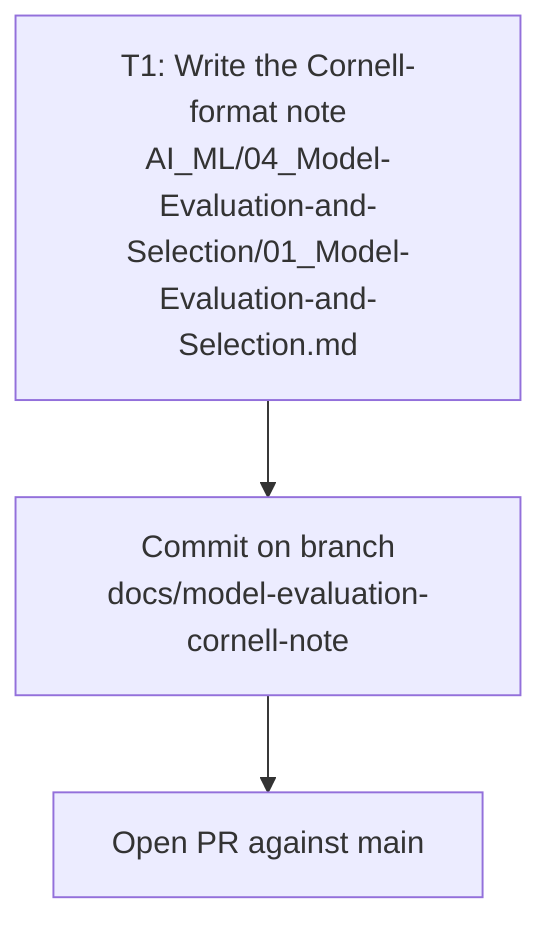

# Plan: Organize the "Model Evaluation and Selection" mindmap into a Cornell note

## Dependency graph

Single vertical slice — one file, one task, no dependencies between sub-steps other than order:

## Checkpoints

1. After T1: the note exists, contains all five required sections, the full original mindmap verbatim, and cross-links to `01_Project-Scoping-and-Dataset`, `03_Diagnostics-and-Error-Analysis`, `01_ML-Fundamentals-and-Terminology`.
2. After commit: `git status` shows only the new note file staged/committed on the task branch; no sibling `AI_ML/` file or `10_System/` file is touched.
3. After PR: description names the untracked main-checkout stub file so the human merger reconciles it deliberately (SPEC A7).

## Task

### T1 — Write the enriched Cornell knowledge note

- **Branch**: `docs/model-evaluation-cornell-note`
- **Files touched**: `AI_ML/04_Model-Evaluation-and-Selection/01_Model-Evaluation-and-Selection.md` (new, this branch)
- **Depends on**: none
- **Acceptance criteria**:
  - [ ] Frontmatter matches the sibling notes' Cornell shape (`cssclasses`, `tags`, `priority`, `order`, `topic-group`, `gist`, `aliases`).
  - [ ] `> [!summary] Summary` gives a 3-bullet overview of the note's scope (loss/cost metrics, regression + classification metrics and losses, other loss functions, model-selection criteria).
  - [ ] `## 📌 Original EdrawMind Mindmap & Note` contains the user's full raw outline, verbatim, inside a `> [!quote]` block.
  - [ ] `> [!cue] What is it?` covers every top-level mindmap branch: probability calibration; regression metrics (scale-dependent, percentage, relative, scale-error, other) and losses (Huber, log loss, RMSE, R², adjusted R², BCE); classification losses (zero-one/exponential, KL divergence, BCE, hinge, sparse categorical CE, label smoothing, multi-label) and metrics (confusion matrix, accuracy/sensitivity/specificity/PPV/NPV, F1, AUC-ROC); other loss functions (triplet, contrastive, Wasserstein, Dice); model-selection criteria (bias-variance tradeoff, error analysis / human-level performance baseline, computation efficiency, evaluating ideas in parallel). Branches with real user content are elaborated in prose; branches that are outline-only headers are captured as a compact index table, not fabricated in detail.
  - [ ] `> [!cue] Why is it important?` ties metric/loss/model-selection choice to real consequences (wrong metric, silent overfitting, production risk), referencing the same theme already used in `01_Project-Scoping-and-Dataset`.
  - [ ] `> [!cue] How is it related to ...?` links `01_Project-Scoping-and-Dataset`, `03_Diagnostics-and-Error-Analysis` (bias-variance theory lives there — this note extends it with error-analysis baselining, not a rewrite), and `01_ML-Fundamentals-and-Terminology` (loss vs. cost distinction).
- **Verification**: manual read-through against the checklist above (`file_assert`; no automated test exists for this workspace).

## Rollback

The task is additive (one new file). If it needs to be undone, revert the single commit on `docs/model-evaluation-cornell-note`; nothing else is touched.
