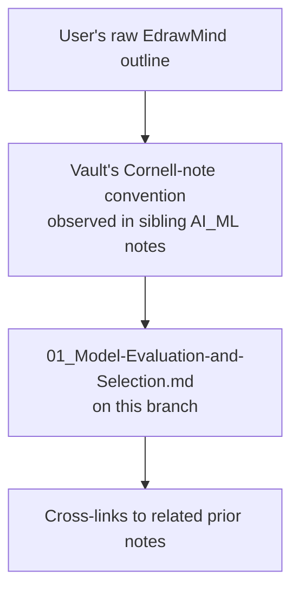

# Research: Organize the "Model Evaluation and Selection" mindmap

## Applicability

This objective needs no outside/citation-based research. Every fact required to complete it is already present in one of two in-repo sources:

1. The user's own EdrawMind outline (pasted in full in the objective) — the source content to organize.
2. The vault's existing, already-established note convention, observed directly in `AI_ML/03_ML-Lifecycle/03_Diagnostics-and-Error-Analysis.md`, `AI_ML/03_ML-Lifecycle/01_Project-Scoping-and-Dataset.md`, `AI_ML/02_Machine-Learning/01_ML-Fundamentals-and-Terminology.md`, and `AI_ML/00_AI-Engineer-MOC.md` (main checkout, read for structure only) — the target shape to produce.

The only "definitions" added beyond the user's own notes are standard, uncontested ML terminology (e.g. that MAPE stands for mean absolute percentage error, that Dice loss is used for segmentation) used solely to label an index/glossary entry for outline leaves the user has not filled in yet — not claims requiring a citation trail.

## Refine

No refinement of the objective is needed: the target path, the template to follow, and the source content were all given directly by the user, and the vault already contains three worked examples of the exact deliverable shape for this same "AI ENGINEER" mindmap family.

## Sources

- In-repo: the four sibling notes named above (read directly, not fetched).
- No external/web sources were needed or used.

## Unresolved questions

None.
